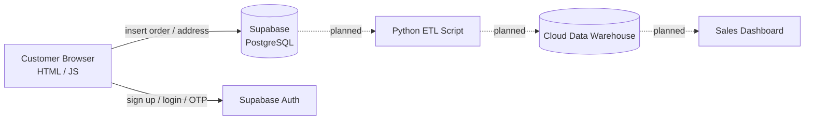

# Advik Jewellers – 1 Gram Gold Jewellery Website

A responsive, single-page e-commerce website for **Advik Jewellers**, a 1 gram gold jewellery shop. Customers can browse the collection, add items to a cart, create an account, and place orders. Orders are saved to a Supabase database.

Built with plain **HTML, CSS and JavaScript** (no build step, no framework).

---

## Features

- **Product catalogue**: 20 products in a responsive grid (2 / 3 / 4 columns depending on screen size) with discount tags and click-to-view images
- **Shopping cart**: slide-in drawer with quantity controls, remove option and live total
- **Persistent cart**: cart is saved in `localStorage`, so it survives page refreshes
- **Buy Now**: skip the cart and go straight to checkout
- **User accounts** (Supabase Auth):
  - Register and log in with email and password
  - Forgot password with email OTP
  - Login is required before placing an order
- **Checkout**:
  - Delivery details form (name, email, phone, address, city, state, pincode)
  - Saved addresses: reuse a previous address or add a new one
  - Payment options: UPI / QR, bank transfer, cash on delivery
  - Optional payment reference / transaction ID
- **Order history**: logged-in users can view their past orders
- **Order confirmation** with a generated order number (e.g. `ADV-2026-12345`)
- **Contact card** with WhatsApp and Call Now buttons
- **Mobile-first design** with a gold, ivory and maroon theme (Cormorant Garamond + Inter fonts)

---

## Tech Stack

| Layer | Technology |
|-------|------------|
| Frontend | HTML5, CSS3 (custom properties, Grid, Flexbox), Vanilla JavaScript |
| Backend / Database | [Supabase](https://supabase.com) (PostgreSQL) |
| Authentication | Supabase Auth (email + password, OTP recovery) |
| Fonts | Google Fonts |
| Storage (client) | Browser `localStorage` for the cart |

---

## Project Structure

```
.
├── index.html        # The whole site: markup, styles and scripts
├── necklace.jpg      # Product images
├── ring.jpg
├── ...
└── README.md
```

> Product images sit in the same folder as `index.html`. Make sure every image referenced in the HTML exists in the repo.

---

## Getting Started

### 1. Clone the repository

```bash
git clone https://github.com/<your-username>/<your-repo-name>.git
cd <your-repo-name>
```

### 2. Run locally

No installation needed. Either:

- Double-click `index.html` to open it in your browser, or
- Serve it with a local server (recommended):

```bash
# Python
python -m http.server 8000

# or Node
npx serve
```

Then open `http://localhost:8000`.

### 3. Set up Supabase

1. Create a free project at [supabase.com](https://supabase.com).
2. Copy your **Project URL** and **anon / publishable key** from *Project Settings → API*.
3. In `index.html`, update:

```js
const SUPABASE_URL = 'https://<your-project>.supabase.co';
const SUPABASE_ANON_KEY = '<your-anon-or-publishable-key>';
```

4. Create the tables in the **SQL Editor**:

```sql
-- Orders
create table orders (
  id bigint generated always as identity primary key,
  created_at timestamptz default now(),
  product_name text,
  quantity int,
  order_total numeric,
  customer_name text,
  customer_email text,
  customer_phone text,
  delivery_pincode text,
  delivery_address text,
  delivery_city text,
  delivery_state text,
  payment_method text,
  transaction_id text
);

-- Saved addresses
create table addresses (
  id bigint generated always as identity primary key,
  created_at timestamptz default now(),
  user_id uuid references auth.users(id),
  address text,
  city text,
  state text,
  pincode text
);
```

5. Enable **Row Level Security** and add policies so users only see their own data:

```sql
alter table orders enable row level security;
alter table addresses enable row level security;

-- Logged-in users can place orders and read their own
create policy "Insert orders" on orders
  for insert to authenticated with check (true);

create policy "Read own orders" on orders
  for select to authenticated
  using (customer_email = auth.jwt() ->> 'email');

-- Users manage only their own addresses
create policy "Read own addresses" on addresses
  for select to authenticated using (user_id = auth.uid());

create policy "Insert own addresses" on addresses
  for insert to authenticated with check (user_id = auth.uid());
```

6. **Forgot-password OTP**: in Supabase go to *Authentication → Email Templates → Reset Password* and make sure the template includes `{{ .Token }}` so users receive a numeric code.

---

## Configuration

### Payment details

Payment info lives in the `PAYMENT_CONFIG` object in `index.html`:

```js
const PAYMENT_CONFIG = {
  upiId: "your-upi-id@bank",
  bankName: "Your Bank Name",
  accountNumber: "XXXXXXXXXXXX",
  ifsc: "XXXX0000000"
};
```

> ⚠️ **Do not commit real bank account details to a public repository.** See [Security Notes](#security-notes).

### Adding or editing a product

Copy an existing `product-card` block in `index.html` and change the image, name, price, discount tag and the values passed to `addToCart(...)` / `buyNow(...)`:

```html
<div class="product-card">
    <a class="product-media" href="my-item.jpg" target="_blank">
        <span class="discount-tag">10% OFF</span>
        
    </a>
    <div class="product-body">
        <h3>My Item</h3>
        <div class="product-price">₹1,999</div>
        <div class="product-actions">
            <button class="btn-add" onclick="addToCart('p21', 'My Item', 1999)">Add to Cart</button>
            <button class="btn-buy" onclick="buyNow('p21', 'My Item', 1999)">Buy Now</button>
        </div>
    </div>
</div>
```

Each product needs a **unique ID** (`p21`, `p22`, ...). Keep the displayed price and the price passed to `addToCart` the same.

### Theme colours

Change the CSS variables at the top of the `<style>` block:

```css
:root {
  --ivory: #FBF6EC;
  --charcoal: #211C15;
  --gold: #B8912F;
  --maroon: #6E1423;
}
```

---

## Deployment

Because this is a static site, it can be hosted for free:

- **GitHub Pages**: *Settings → Pages → Deploy from branch → `main` / root*
- **Netlify** or **Vercel**: drag and drop the folder or connect the repo

After deploying, add your site URL under *Supabase → Authentication → URL Configuration*.

---

## Security Notes

- The Supabase **anon/publishable key** is designed to be public, but it is only safe if **Row Level Security** is enabled with proper policies (see the SQL above).
- **Never commit** your Supabase `service_role` key.
- Bank account numbers and UPI IDs in client-side JavaScript are visible to anyone who views the page source or the repo. Consider showing them only at checkout from a server-side source, or keep them out of the public repo.
- Prices and totals are calculated in the browser, so they can be edited by a user. Verify order totals on the server before treating an order as confirmed.

---

## Data Engineering Perspective

Besides being a storefront, this project generates real transactional data, which makes it a good base for practising data engineering.

### Data Flow



Solid arrows are implemented. Dotted arrows are planned.

### Data Model

| Table | Purpose | Key columns |
|-------|---------|-------------|
| `orders` | One row per placed order | `product_name`, `quantity`, `order_total`, `customer_email`, `delivery_city`, `payment_method`, `created_at` |
| `addresses` | Saved delivery addresses per user | `user_id`, `address`, `city`, `state`, `pincode` |
| `auth.users` | Managed by Supabase Auth | `id`, `email` |

Security is handled with **Row Level Security** policies, so each user can only read their own orders and addresses.

### Skills Demonstrated

- Relational database design (PostgreSQL)
- Writing SQL: `CREATE TABLE`, foreign keys, and RLS policies
- Working with a cloud-hosted backend (Supabase)
- Client-to-database data capture using the JavaScript SDK
- Authentication flows (email/password, OTP recovery)

### Data Engineering Roadmap

- [ ] Normalise orders into `orders` and `order_items` tables (one row per product per order)
- [ ] Add a `products` table and load the catalogue from the database
- [ ] Write a Python + pandas script to extract orders and clean them (nulls, `'N/A'` placeholders, duplicates)
- [ ] Load cleaned data into a cloud warehouse (BigQuery / Redshift / Snowflake)
- [ ] Schedule the pipeline (cron, GitHub Actions, or Airflow)
- [ ] Build analytics queries: revenue by day, top products, sales by city, payment method split
- [ ] Create a dashboard (Looker Studio / Power BI / Metabase)
- [ ] Add data quality checks and pipeline logging

---

## Roadmap

- [ ] Online payment gateway (Razorpay / PhonePe)
- [ ] Admin dashboard to manage products and orders
- [ ] Product data loaded from the database instead of hard-coded HTML
- [ ] Order status tracking
- [ ] Search and category filters
- [ ] Email / WhatsApp order notifications

---

## Contact

**Advik Jewellers**, Barshikar

Order or enquire directly through the WhatsApp and Call buttons on the website.

---

## License

This project is for the Advik Jewellers business. All rights reserved. Add a license file if you want to make it open source (for example, MIT).
